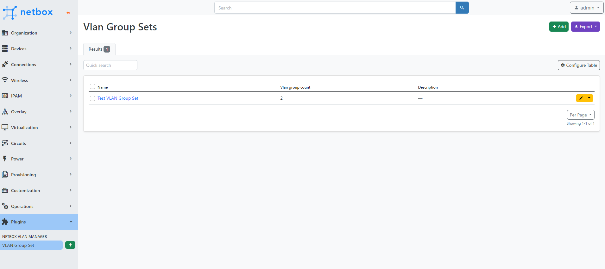

# NetBox VLAN Manager

NetBox plugin for viewer of multiple VLAN Group spaces.

## Features

This plugin provide follwing Models:

- VLAN Group Set

## Compatibility

Each Plugin Version listed below has been tested with its corresponding NetBox Version.

| NetBox Version | Plugin Version |
| :------------: | :------------: |
|      3.4       |     0.0.1      |

## Installation

The plugin is available as a Python package in pypi and can be installed with pip:

```bash
pip install netbox-vlan-manager
```

Enable the plugin in /opt/netbox/netbox/netbox/configuration.py

```python
PLUGINS = ['netbox-vlan-manager']
```

Restart NetBox

## Configuration

Currently, This plugin is not necessary plugin configuration

## Screenshots

VLAN Group Set List


VLAN Group View Set with VLANs

